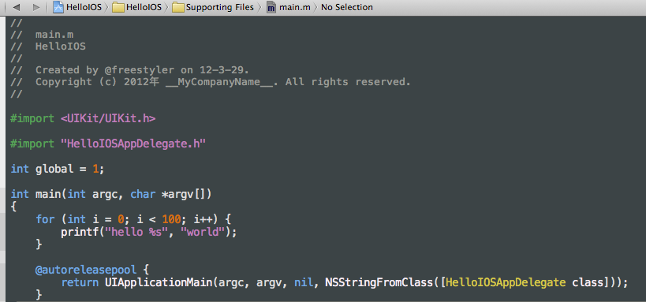

Install
==========

## Theme

```
mkdir -p ~/Library/Developer/Xcode/UserData/FontAndColorThemes;
cp /path/to/xcode4theme/Luser.dvtcolortheme  ~/Library/Developer/Xcode/UserData/FontAndColorThemes;
```




## KeyBinding

```
~/Library/Developer/Xcode/UserData/KeyBindings/;
cp /path/to/xcode4theme/Default.idekeybindings ~/Library/Developer/Xcode/UserData/KeyBindings/
```


restart Xcode
